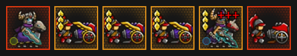

# Text to unit generator

## About

This small script helps transforming unit abbreviatons mainly from [ToT Megasheet Of Solutions](https://docs.google.com/spreadsheets/d/1lp1PwicC9QwwQye32IwLriIV0H4OQcrcpWPYDbxeu30) to human viewable form

Can also be handy for generating images for guides

## Usage

You can use it by starting [output.ipynb](output.ipynb) in [Jupiter Notebook](https://jupyter.org/), [VSCode](https://code.visualstudio.com/) or directly running [main.py](main.py)

Unit string should be in the following format: `[T1-6]<Unit name or abbreviation>[(PI)/(MI)][*0-9223372036854775807]` (Although `*9223372036854775807` is totally not recommended for your pc)

Example string: `DK(PI) T3Gunner*3 T6DK(MI) Gunner`

Which will result in:

**You can't use `T*` with `Sr` prefix**

## Table of contents

- [main.py](main.py) : Unit generator itself, converted automatically from `output.ipynb`
- [output.ipynb](output.ipynb) : Basically `main.py` but in notebook form
- [units.db](units.db) : Main units database
- - `units`  : Table with all the units
- - - `id`   : Unique unit id
- - - `name` : Unit name in english
- - - `*_name` : Localized unit name, feel free to add new ones yourself
- - - `short` : Defalut unit abbreviation
- - - `alt_short[_*]` : Alternative unit abbreviations
- - - `star` : Defalut unit stars count
- [generator.ipynb](generator.ipynb) : Creates SQL lines to add unit translations to DB
- [dowload.ipynb](dowload.ipynb) : Script to automatically download images from [Endless Frontier Wikia](https://endless-frontier.fandom.com)
- [./normal](normal) : Default unit skins
- [./senior](senior) : Senior unit skin variants
- [./system](system) : Sprites used by script to generate images
- - `*-star.png` : Unit backgrounds
- - [empty_unit.png](system/empty_unit.png) : Default unit background
- - [immune-m.png](system/immune-m.png) : Magic immunity sprite
- - [immune-p.png](system/immune-p.png) : Physical immunity sprite
- - [plus.png](system/plus.png) : Sprite for multiple units used in ToT, called by giving a unit T4-6
- - [tier.png](system/tier.png) : Unit transendance sprite